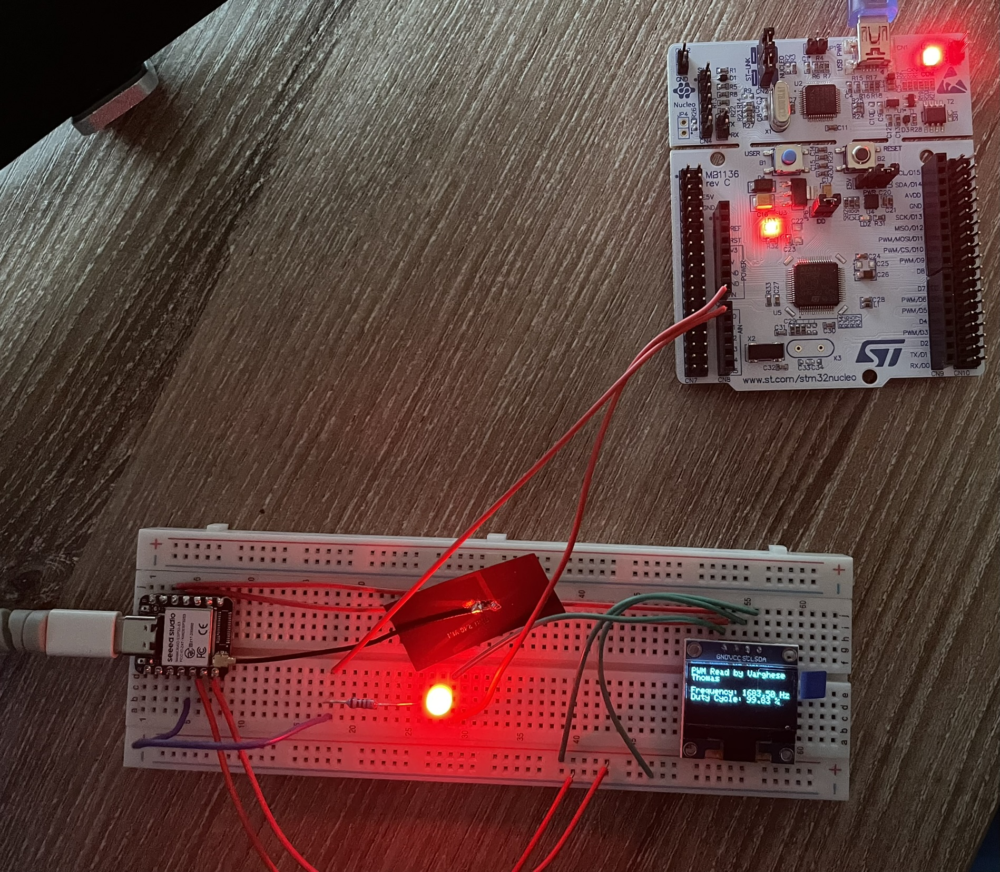
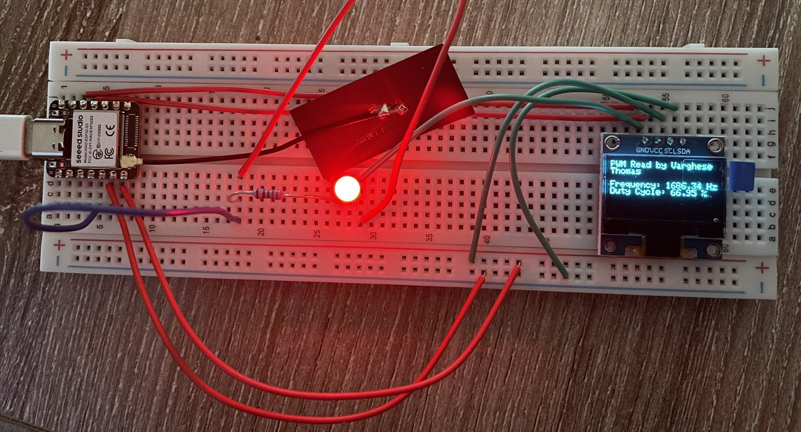
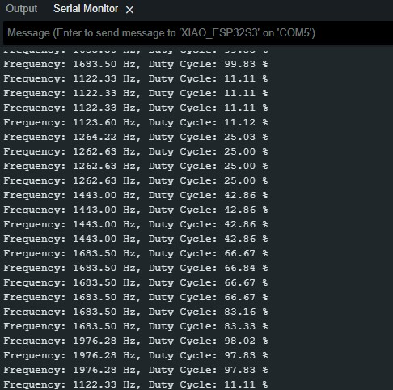

# STM32 PWM Generation and ESP32 IoT Monitoring with MQTT

This project demonstrates generating a PWM signal using STM32 and monitoring it with an ESP32. The ESP32 measures the frequency and duty cycle of the PWM signal, displays the results on an OLED screen, and publishes them to an MQTT broker. The data can be monitored live using tool MQTT Explorer.

## Features
### STM32:
- Generates PWM signals using TIM2 timer.
- Continuously create PWM signal varying duty cyle from 0 to 100% 

### ESP32:
- Measures PWM signal frequency and duty cycle.
- Displays the measured values on an OLED screen.
- Publishes data in JSON format to an MQTT broker.
- IoT integration with MQTT for live data monitoring.

## Project Structure
The repository is organized into two main sections:
1. **Stm32Nucleo_PWM**: Contains the source code and configuration for generating the PWM signal(main.c).
2. **ESP32_PWM_MQTT**: Contains the source code for measuring and publishing the signal data.

---

### STM32 Setup
1. **Hardware**:
   - STM32 nucleo f401re
   - LED for visualizing PWM

2. **Main File**:
   - `STM32/main.c`: The primary code for generating PWM signals.

---

### ESP32 Setup
1. **Hardware**:
   - Seeed XIAO ESP32-S3
   - OLED display
   - Wi-Fi network for MQTT connectivity.

2. **Steps**:
   - Set your Wi-Fi SSID, password, and MQTT broker details in the code(Line 10 to 16).
   - Use MQTT Explorer or any MQTT client to view the published data.

---

## Results
### Images
1. **STM32 & ESP32 PWM Generation setup**
   

2. **ESP32 OLED Display**
   

3. **MQTT Data in MQTT Explorer**
   

4. **ESP32 data on serial monitor**
   
---

